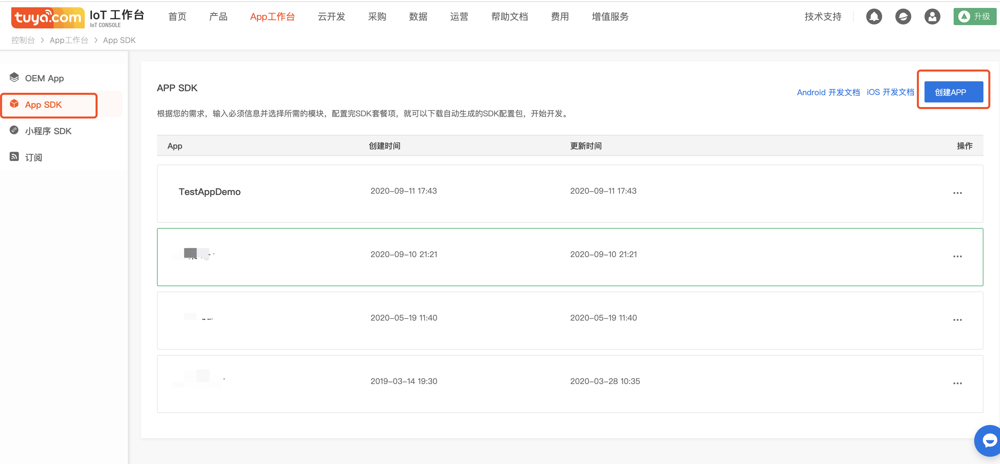

# 集成准备

## 创建 SDK 应用

1. 在[涂鸦 IoT 平台](https://iot.tuya.com/)中 “ App 工作台” 中点击 "App SDK" ,点击“获取 SDK ”,

2. 根据需求选择合适的开发方案，点击“下一步”。

3. 根据提示输入创建的 app 信息，点击 ”下一步“。

4. 在安卓部分可以获取 AppKey、AppSecret。点击"下载安全图片"，“Android 下载（Gradle）”下载所需要的安全图片和依赖包信息。
